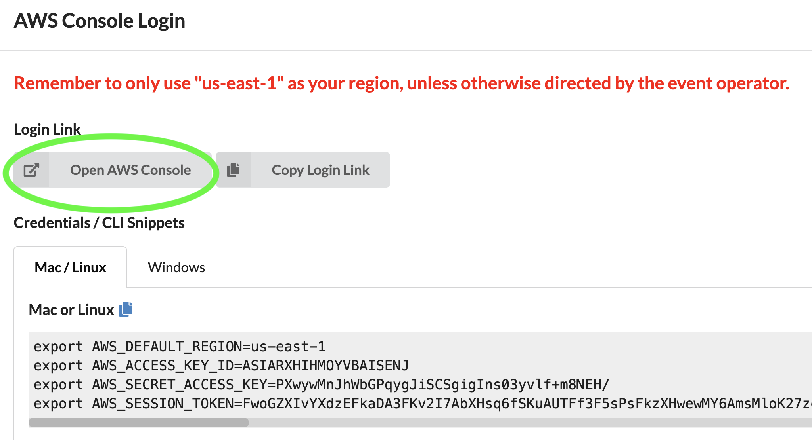

## Sagemaker Feature Engineering, AutoPilot, and SHAPley workshop

### Lab description

This lab demonstrates several SageMaker Jupyter Notebooks focusing on:
- Feature Engineering
- End-2-End ML flow
- Automated Feature Engineering, Model Selection and Optimization with SageMaker AutoPilot
- Model Explainability
- Bring-your-own Model/Container

### Steps for launching the workshop environment using EVENT ENGINE 
Note: these steps were tested on Chrome browser using Mac OS
#### open a browser and navigate to https://dashboard.eventengine.run/login
#### Enter a 12-character "hash" provided to you by workshop organizer.
#### Click on "Accpet Terms & Login"

#### Click on "AWS Console"

#### Please, log off from any other AWS accounts you are currently logged into

#### Click on "Open AWS Console"

#### You should see a screen like this with your notebook being created. The name of your notebook will be different. In a couple of minutes, its status will change
#### from "Pending" to "In Service", at which point, please click on "Open Jupyter" or "Open JupyterLab"

#### In Jupyter Notebook console, you should see a folder structure similar to this: 

## License

This library is licensed under the MIT-0 License. See the LICENSE file.

